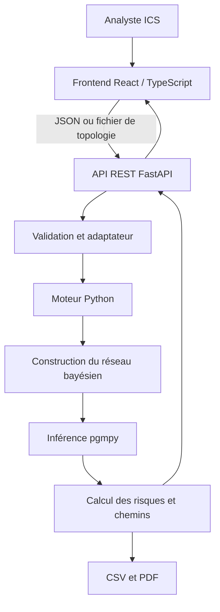
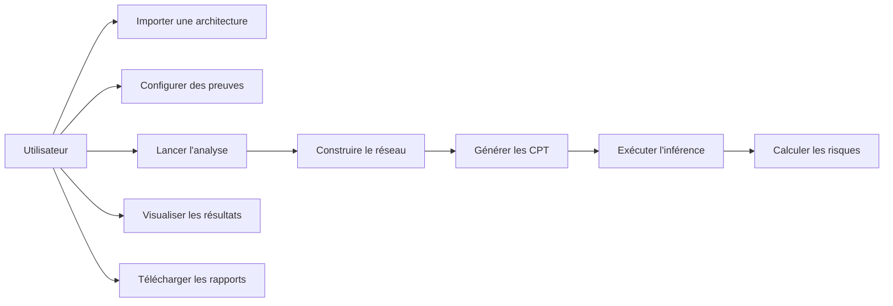
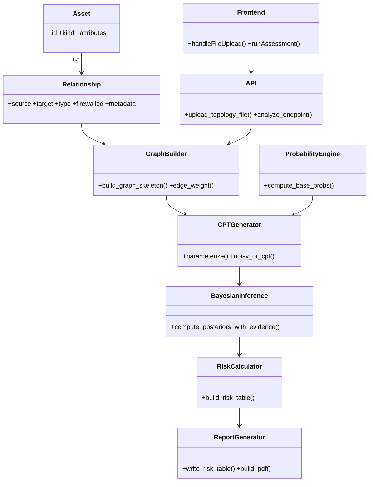
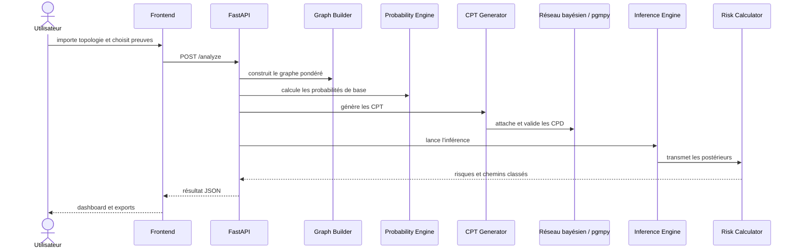

# Développement d'un framework générique d'évaluation quantitative des risques ICS fondé sur les réseaux bayésiens

## Page de garde

| Élément | Information |
|---|---|
| Auteur | À compléter |
| Organisme d'accueil | À compléter |
| Encadrant de stage | À compléter |
| Date | 21 juillet 2026 |
| Projet | *Development of a Generic Bayesian Network-Based Framework for Quantitative Risk Assessment of Industrial Control Systems (ICS)* |

---

## Résumé

Les systèmes de contrôle industriel (*Industrial Control Systems*, ICS) pilotent des procédés physiques dont l'indisponibilité ou la compromission peut avoir des conséquences de sûreté, environnementales et économiques. L'évaluation de leur risque cyber ne peut pas se limiter à une liste de vulnérabilités : elle doit tenir compte de la topologie, des dépendances entre actifs, des protections, de l'incertitude et des observations disponibles pendant un incident.

Ce projet réalise un framework générique qui transforme une description d'architecture ICS en réseau bayésien discret. Il calcule des probabilités intrinsèques de compromission, paramètre automatiquement les tables de probabilités conditionnelles (CPT) selon un modèle *Noisy-OR*, exécute une inférence exacte tenant compte des preuves, puis classe les actifs par risque. Une application Web permet d'importer une topologie JSON, YAML ou CSV, de sélectionner des preuves, d'exécuter l'analyse, d'inspecter le réseau et de télécharger un registre des risques ainsi qu'un rapport PDF de synthèse.

L'objectif est de fournir une base explicable et réutilisable pour l'analyse quantitative de scénarios ICS. Le résultat est un prototype fonctionnel, modulaire et testable ; ses paramètres restent configurables afin d'être adaptés à un contexte industriel réel et à des données de terrain.

## Introduction générale

Un ICS regroupe les équipements, logiciels et opérateurs qui supervisent ou commandent un procédé industriel : automates programmables (PLC), interfaces homme-machine (HMI), serveurs SCADA, capteurs, actionneurs et postes d'ingénierie. Contrairement à un système d'information classique, une erreur de commande ou une indisponibilité peut affecter directement le monde physique. Les exigences de disponibilité, de sûreté et de continuité d'exploitation y sont donc déterminantes.

Les méthodes classiques, par exemple une matrice « vraisemblance × impact », restent utiles pour un premier tri mais décrivent difficilement la propagation d'une compromission, l'effet d'un pare-feu ou l'évolution d'un diagnostic lorsqu'une preuve est observée. Les réseaux bayésiens répondent à cette limite : ils représentent des dépendances causales sous forme de graphe orienté acyclique et mettent à jour les probabilités à partir d'observations.

Le projet vise ainsi à concevoir un framework générique, transparent et exploitable par un analyste de risque. Les chapitres suivants présentent le besoin, l'architecture, les choix techniques, la chaîne de calcul, l'interface et les perspectives d'industrialisation.

## 1. Présentation du projet

### 1.1 Problème et besoin

Une topologie ICS contient des actifs hétérogènes et des liens de nature différente : un poste peut programmer un automate, un automate peut commander un actionneur, ou une HMI peut surveiller un procédé. Il faut convertir ces relations en un modèle quantitatif capable de répondre à des questions telles que : « Quelle est la probabilité qu'un automate soit compromis si une HMI l'est ? » et « Quels actifs doivent être traités en priorité ? ».

Le framework accepte une topologie structurée, valide ses actifs et relations, puis produit un classement des risques. Les utilisateurs cibles sont les analystes cybersécurité ICS, les ingénieurs OT, les responsables de sûreté et les encadrants ayant besoin d'un résultat compréhensible sans manipulation directe de code Python.

### 1.2 Fonctionnalités livrées

- modélisation d'actifs humains, techniques et physiques ;
- import de topologies JSON, YAML ou CSV, et jeux de données prédéfinis ;
- représentation pondérée des dépendances et des contrôles ;
- calcul automatique de probabilités de base et de CPT ;
- inférence bayésienne à partir de preuves « Compromised » ou « Safe » ;
- calcul et classement des risques, identification de chemins d'attaque ;
- tableau de bord Web, visualisation de graphe, inspection des CPT ;
- export ciblé d'un registre de risques CSV et d'un rapport PDF.

## 2. Architecture générale

L'architecture sépare l'expérience utilisateur, les contrats HTTP et le moteur scientifique. Cette séparation évite que l'interface ne porte des règles de calcul et rend le moteur utilisable aussi en ligne de commande ou par une autre API.



| Composant | Rôle |
|---|---|
| Frontend | Choix de topologie, saisie des preuves, lancement, visualisation et téléchargement. |
| API REST | Validation des requêtes, import de fichier, gestion des paramètres et exposition des résultats. |
| Moteur | Chargement, pondération, paramétrage probabiliste, inférence et calcul du risque. |
| Réseau bayésien | Graphe orienté et CPT décrivant les dépendances de compromission. |
| Sorties | Résultats JSON internes, registre CSV et rapport PDF destinés à la décision. |

## 3. Technologies et justification

### 3.1 Frontend

React structure l'interface en composants et met à jour le tableau de bord après une analyse sans rechargement. TypeScript sécurise les contrats manipulés par l'interface (`TopologyPayload`, résultat d'analyse, preuves) et réduit les erreurs de typage. Vite apporte une boucle de développement et une construction de production rapide ; Tailwind CSS fournit des classes cohérentes pour une interface responsive sans multiplier les feuilles de style spécifiques.

React Flow rend le graphe manipulable (zoom, déplacement, sélection de nœud), tandis que Recharts construit les graphiques de distribution et de probabilités. Les appels HTTP utilisent l'API native `fetch`, suffisante ici et sans dépendance supplémentaire. Axios est donc une alternative possible, mais n'est pas une dépendance actuelle du projet.

### 3.2 Backend et moteur

Python a été choisi pour son écosystème scientifique. FastAPI expose des routes REST typées et asynchrones lorsque nécessaire ; Uvicorn est le serveur ASGI approprié à son exécution. Pydantic valide les corps de requête, notamment les preuves et topologies, avant d'appeler le moteur.

pgmpy fournit le modèle de réseau bayésien discret, les CPD et l'algorithme `VariableElimination`. NetworkX sert à la manipulation et au dessin de graphes pour les artefacts ; Matplotlib produit l'image PNG en mode non interactif. Pandas construit et exporte le registre tabulaire. Les dépendances déclarées n'incluent pas NumPy directement : il peut être transitif via l'écosystème scientifique, mais aucune logique applicative ne dépend de son API. Graphviz n'est pas utilisé : le rendu actuel repose sur NetworkX/Matplotlib.

### 3.3 Exports et versionnement

Le CSV est privilégié pour un registre ouvrable et triable dans un tableur. Le JSON reste un format interne d'audit pour le graphe, les CPT et les postérieurs. Le PDF présente la synthèse lisible par un décideur. Git assure l'historique local ; GitHub est la cible naturelle de collaboration et de revue, sous réserve de la politique de l'organisme.

| Technologie | Pourquoi | Alternative | Motif du choix |
|---|---|---|---|
| React + TypeScript | UI interactive et contrat de données explicite | Vue, Angular | Écosystème mature et composants adaptés au dashboard. |
| Vite | Build et serveur de développement rapides | Webpack | Configuration plus légère pour une SPA. |
| FastAPI + Pydantic | API typée, documentation automatique possible | Flask, Django | Validation déclarative et intégration naturelle Python. |
| pgmpy | CPD et inférence bayésienne exacte | implémentation maison | Réduit le risque d'erreur dans l'algorithme d'inférence. |
| NetworkX + Matplotlib | Graphe et export PNG Python | Graphviz | Déjà intégrés au moteur ; aucun binaire externe requis. |
| Pandas | Table de risques et CSV | module `csv` | Tri, colonnes et formatage robustes. |
| `fetch` | Client HTTP natif | Axios | Besoin couvert sans ajouter de dépendance. |

## 4. Fonctionnement détaillé du framework

La chaîne suivante établit une trace claire entre l'architecture importée et le résultat présenté.

1. **Chargement des actifs.** `assets.py` lit JSON, YAML ou CSV, normalise la structure et vérifie les champs requis par type d'actif. Un équipement contient notamment CVSS, exposition et état de correctif ; un humain contient rôle, sensibilisation et privilège.
2. **Construction du graphe.** `graph_builder.py` crée un graphe orienté. Chaque relation reçoit un poids initial selon son type (`controls`, `actuates`, `connects-to`, etc.), ajusté par le pare-feu, le protocole, le niveau de confiance et un identifiant MITRE éventuellement fourni.
3. **Probabilités de base.** `probability.py` estime la probabilité intrinsèque. Pour un équipement, elle combine CVSS, exposition et correctif ; pour un humain, risque de phishing, sensibilisation et privilège ; pour un actif physique, une valeur explicite peut être fournie. La valeur est plafonnée à 0,95.
4. **Génération des CPT.** `cpt_generator.py` paramètre chaque nœud. Pour un nœud sans parent, la CPT est sa probabilité de base. Sinon le modèle *Noisy-OR* évite de définir manuellement les `2^k` cas tout en conservant une CPT complète :

   `P(N=1 | Pa) = 1 - (1 - P_base(N)) × Π(1 - w_i)` pour les parents compromis.

5. **Réseau bayésien.** Les CPT sont attachées au modèle pgmpy et `check_model()` vérifie la cohérence probabiliste.
6. **Inférence.** `inference.py` nettoie les preuves, refuse les nœuds inconnus et interroge `VariableElimination` pour obtenir `P(actif compromis | preuves)`.
7. **Propagation et chemins.** Les poids de liens permettent de classer les chemins partant d'une preuve compromise, ou des sources du graphe en l'absence de preuve, vers les actifs risqués.
8. **Calcul du risque.** `risk.py` calcule un impact à partir de la sévérité de conséquence et du périmètre, puis `risque = probabilité postérieure × impact`. Le tableau est trié par risque décroissant.
9. **Visualisation.** L'API renvoie graphe, postérieurs, CPT, classement, chemins et résumé. Le frontend les rend sous forme de tableau de bord et prépare les deux exports décisionnels.

## 5. Description des modules principaux

| Module | Entrées | Traitement et sorties |
|---|---|---|
| `assets.py` | Fichier ou dictionnaire de topologie | Parse, normalise et valide ; renvoie `assets` et `relationships`. |
| `graph_builder.py` | Relations, identifiants d'actifs | Calcule les poids et construit `DiscreteBayesianNetwork`; sérialise aussi le graphe. |
| `probability.py` | Attributs d'actifs | Retourne une probabilité de base par actif. |
| `cpt_generator.py` | Modèle, poids, probabilités | Produit des `TabularCPD` via *Noisy-OR* et une vue JSON des CPT. |
| `inference.py` | Modèle paramétré, preuves | Valide les preuves et retourne les marges postérieures. |
| `risk.py` | Postérieurs, attributs | Calcule impact et risque ; exporte un CSV à trois décimales. |
| `attack_paths.py` | Relations, poids, preuves, risques | Recherche et classe des chemins de propagation plausibles. |
| `main.py` | Topologie et preuves | Orchestration de bout en bout ; résultats et artefacts. |
| `backend/app/main.py` | Requêtes HTTP | Routes d'import, analyse, réglages et rapports. |

Cette modularité facilite les tests unitaires et le remplacement d'une règle de pondération sans réécrire l'interface.

## 6. Interface Web et scénario utilisateur

L'utilisateur ouvre la carte **Topology & Assessment**, choisit un jeu de données ou importe un fichier, puis confirme visuellement le nombre d'actifs et de connexions actifs. Il peut ensuite marquer des actifs comme compromis, sûrs ou inconnus dans la sélection de preuves. Le bouton **Run assessment** envoie topologie et preuves à `/analyze`.

Le tableau de bord présente le réseau, les probabilités postérieures, les actifs les plus risqués, les chemins d'attaque et les CPT inspectables. Le classement par niveau de risque utilise une légende responsive sous le diagramme circulaire : les libellés ne se recouvrent pas. Enfin, la carte **Reports** limite volontairement les téléchargements au registre CSV et au rapport PDF, plutôt que d'exposer des artefacts de débogage peu utiles à la décision.

## 7. Diagrammes UML

### 7.1 Cas d'utilisation



### 7.2 Diagramme de classes conceptuel



### 7.3 Diagramme de séquence



## 8. Planification prévisionnelle du stage

Les dates de début ne sont pas fournies dans le projet ; le tableau est un planning réaliste à adapter à la convention, jusqu'au 15 août.

| Activité | Avril | Mai | Juin | Juillet | 1–15 août |
|---|---:|---:|---:|---:|---:|
| Analyse des besoins et étude bibliographique | ███ | █ |  |  |  |
| Conception de l'architecture | █ | ███ |  |  |  |
| Backend et modèle de données |  | ███ | █ |  |  |
| Réseau bayésien, CPT et inférence |  | ██ | ███ |  |  |
| Calcul des risques et chemins |  |  | ██ | █ |  |
| Frontend et visualisations |  |  | ██ | ███ |  |
| Tests et corrections |  |  |  | ██ | ██ |
| Rédaction du rapport |  | █ | ██ | ███ | ██ |
| Préparation de la soutenance |  |  |  | █ | ██ |

## 9. Difficultés rencontrées et réponses techniques

La première difficulté est la modélisation des dépendances : une relation métier ne correspond pas automatiquement à une probabilité. Le projet utilise donc des poids configurables et des multiplicateurs explicites, afin que les hypothèses puissent être documentées et calibrées. La génération des CPT est le second défi : le nombre de combinaisons croît exponentiellement avec les parents. Le *Noisy-OR* automatise ce travail tout en gardant une interprétation claire.

L'inférence doit également distinguer une absence de preuve d'une preuve négative. La validation conserve donc l'état `Unknown` hors de l'évidence et transmet explicitement les états compromis/sûrs. Côté Web, la difficulté est de rendre un graphe dense sans perdre la lisibilité ; React Flow apporte les interactions de navigation et les graphiques dissocient probabilités, risques et chemins. Enfin, la séparation frontend/backend évite les incohérences de validation et permet des tests automatisés des routes et des exports.

## 10. Résultats obtenus

Le projet fournit un framework fonctionnel de bout en bout : import et validation de topologies, construction automatique du réseau, calcul des probabilités, CPT, inférence exacte, classement des risques, recherche de chemins et interface Web. Les tests présents couvrent notamment l'inférence, les sorties, l'API et les exports. La construction de production du frontend valide également le typage TypeScript.

Les résultats doivent toutefois être interprétés comme une aide à la décision. La qualité quantitative dépend du calibrage des coefficients, de la précision de la topologie et de la représentativité des données de vulnérabilité et d'incident.

## 11. Perspectives

- calibrer les paramètres à partir d'historiques d'incidents, d'audits et d'experts métier ;
- importer automatiquement des inventaires OT et formats industriels ;
- proposer une simulation de scénarios et une comparaison de contre-mesures ;
- enrichir les relations avec MITRE ATT&CK for ICS et des sources de vulnérabilités ;
- gérer des observations temporelles et calculer en quasi temps réel ;
- ajouter authentification, contrôle d'accès, journalisation et déploiement conteneurisé ou cloud ;
- étudier l'approximation ou la décomposition du réseau pour les topologies très grandes.

## Conclusion

Le framework répond au besoin d'une évaluation de risque ICS qui relie architecture, vulnérabilités, dépendances et observations. Son principal apport est de rendre le raisonnement probabiliste explicite et reproductible, de l'import de la topologie jusqu'au registre de risques. L'architecture modulaire et l'interface Web en font une base crédible pour un travail de recherche appliquée ou une future industrialisation. La prochaine étape essentielle est le calibrage des hypothèses avec des données et des experts du domaine.

## Annexes

### A. Arborescence utile

```text
ICS_Bayesian_Risk_Framework/
├── assets.py, graph_builder.py, probability.py
├── cpt_generator.py, inference.py, risk.py, attack_paths.py, main.py
├── backend/app/                 # API FastAPI et schémas Pydantic
├── frontend/src/App.tsx         # tableau de bord React
├── data/                        # topologies de démonstration
├── output/                      # artefacts d'analyse
└── tests/                       # tests automatisés
```

### B. Exemple de CPT

Pour un automate avec une probabilité de base de 0,10 et deux parents compromis de poids 0,50 et 0,30, la ligne où les deux parents sont à 1 vaut : `1 - (1 - 0,10) × (1 - 0,50) × (1 - 0,30) = 0,685`. La CPT contient aussi les trois autres combinaisons de parents, ce qui permet à l'inférence de conditionner chaque scénario.

### C. Glossaire

| Acronyme | Définition |
|---|---|
| ICS | *Industrial Control System*, système de contrôle industriel. |
| OT | *Operational Technology*, technologies pilotant le procédé physique. |
| PLC | *Programmable Logic Controller*, automate programmable. |
| HMI | *Human-Machine Interface*, interface homme-machine. |
| SCADA | Système de supervision et d'acquisition de données. |
| CPT/CPD | Table/distribution de probabilités conditionnelles. |
| API REST | Interface HTTP reposant sur des ressources et verbes standardisés. |
| CVSS | Score standard de sévérité de vulnérabilité. |
